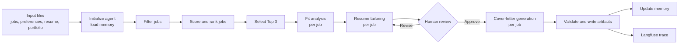

# Job Search Agent

An agentic job-search workflow that filters and ranks jobs, analyzes candidate
fit, tailors a resume, pauses for human review, and generates a complete
application package. The interface is built with Streamlit and the workflow is
orchestrated with LangGraph.

> All candidate and job details in this repository are fictional.

## Architecture


The agent loads the jobs dataset, candidate preferences, master resume,
portfolio, and persistent memory. It then invokes five registered tools in the
workflow below. Fit analysis and resume tailoring run for each of the Top 3
jobs, followed by one combined human-review gate. Approved or revised resumes
are then used to generate the final cover letters and application artifacts.



Main components:

- `src/agent/`: LangGraph state, controller, tool selection, and workflow graph
- `src/tools/`: filtering, scoring, fit analysis, resume tailoring, and
  cover-letter tools
- `src/review/`: human-review and persistent-memory logic
- `src/tracing/`: Langfuse observability
- `app/`: Streamlit UI and artifact-loading services
- `tests/`: unit, integration, and preflight tests

## Repository Deliverables

This repository includes the artifacts required by section 5.3:

| Requirement | Location |
| --- | --- |
| Agent code (Python) | `src/` and `app/` |
| README, architecture, setup, and run instructions | `README.md` and `architecture.png` |
| Jobs CSV | `data/jobs.csv` |
| Candidate resume source | `data/resume.tex` |
| Compiled candidate resume | `outputs/ui-live-20260727-023453-679457/<job-id>/resume_before.pdf` |
| Project portfolio | `data/portfolio.txt` |
| Memory written by the agent | `outputs/memory.json` and the run-specific `memory.json` |
| Application packages for at least 3 jobs | `outputs/ui-live-20260727-023453-679457/J017/`, `J023/`, and `J028/` |

`resume_before.pdf` is the compiled, unchanged candidate resume generated from
`data/resume.tex` and preserved inside each job package for before/after
comparison.

The submitted run contains one folder per selected job:

```text
outputs/ui-live-20260727-023453-679457/
├── J017/
│   ├── job_details.json
│   ├── resume_before.pdf
│   ├── resume_after.pdf
│   ├── cover_letter.pdf
│   ├── fit_analysis.md
│   └── fit_analysis.json
├── J023/
│   └── ...same required artifacts...
└── J028/
    └── ...same required artifacts...
```

Each job folder also contains the human-review decision, revision history, and
change log. The run root contains ranked and rejected jobs, its manifest,
memory, trace events, and the public trace URL.

## Requirements

- Python 3.12
- `pdflatex`
- DeepInfra API credentials
- Langfuse credentials for live tracing

On macOS, install a LaTeX distribution with:

```bash
brew install --cask basictex
eval "$(/usr/libexec/path_helper)"
pdflatex --version
```

## Setup

From the repository root:

```bash
conda create -n job-search-agent python=3.12 -y
conda activate job-search-agent
python -m pip install --upgrade pip
python -m pip install -r requirements.txt
cp .env.example .env
```

Add credentials and runtime configuration to `.env`:

```env
LLM_MODEL=your-provider/your-model
DEEPINFRA_API_KEY=your-deepinfra-api-key
DEEPINFRA_BASE_URL=https://api.deepinfra.com/v1/openai

LANGFUSE_PUBLIC_KEY=your-langfuse-public-key
LANGFUSE_SECRET_KEY=your-langfuse-secret-key
LANGFUSE_HOST=https://us.cloud.langfuse.com

OUTPUT_DIR=outputs
```

Verify Python dependencies, credentials, input files, LaTeX packages, and
output permissions:

```bash
python tests/preflight.py
```

## Run

Start the Streamlit application from the repository root:

```bash
conda activate job-search-agent
streamlit run app/streamlit_app.py
```

Then open the local URL printed by Streamlit. Upload or review the four input
files, start a run, and submit the combined Top 3 human review when prompted.
The app writes the completed run to `outputs/<run-id>/`.

To inspect the included submission without calling the model, use **Open run**
in the app and select:

```text
ui-live-20260727-023453-679457
```

## Input Files

The default inputs are:

```text
data/
├── jobs.csv
├── preferences.yaml
├── resume.tex
└── portfolio.txt
```

`jobs.csv` must include:

```text
job_id,title,company,industry_domain,location,remote,description,
required_skills,years_experience_required,company_details,url,
salary_min,salary_max
```

`resume.tex` is the candidate's master LaTeX resume. `portfolio.txt` provides
project and skill evidence that the agent may cite. `preferences.yaml` contains
target roles, locations, salary constraints, exclusions, and master skills.

## Output Contract

Every selected job is written to `outputs/<run-id>/<job-id>/` with at least:

```text
job_details.json       # selected job details
resume_before.pdf      # compiled master resume before tailoring
resume_after.pdf       # tailored and compiled resume
cover_letter.pdf       # generated and compiled cover letter
fit_analysis.md        # human-readable fit analysis
fit_analysis.json      # structured fit analysis
```

The agent also persists learned review facts to `outputs/memory.json`, allowing
future runs to reuse accepted candidate evidence and preferences.

## Tests

Run the full test suite:

```bash
pytest -q
```
