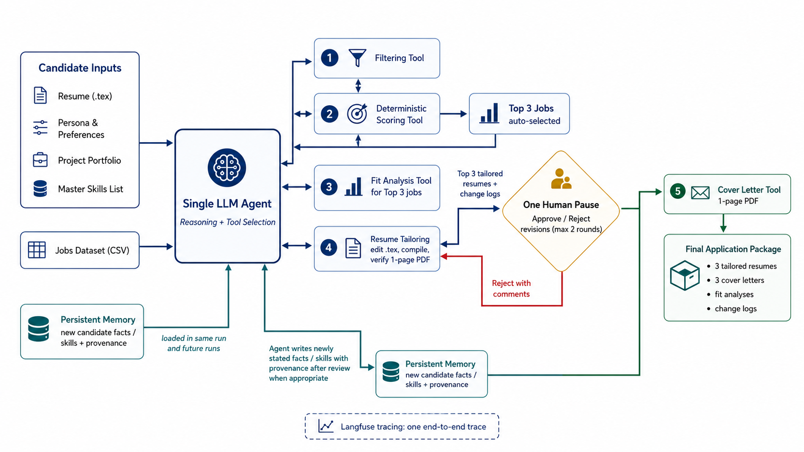

# Job Search Agent

A single-agent job-search workflow that filters and ranks jobs, analyzes candidate fit, tailors resumes, pauses for human review, updates persistent memory, and generates application packages for the Top 3 jobs.

Built with Streamlit, LangGraph, DeepInfra, and Langfuse.

> All candidate and job data in this repository are fictional.

## Architecture



The system uses one LLM-driven agent with five callable tools. Job scores are calculated by deterministic Python code, not generated by the LLM.

## Requirements

* Python 3.12
* `pdflatex`
* DeepInfra API credentials
* Langfuse credentials

## Setup

From the repository root:

```bash
conda create -n job-search-agent python=3.12 -y
conda activate job-search-agent

python -m pip install --upgrade pip
python -m pip install -r requirements.txt

cp .env.example .env
```

Add the required configuration to `.env`:

```env
LLM_MODEL=your-provider/your-model

DEEPINFRA_API_KEY=your-deepinfra-api-key
DEEPINFRA_BASE_URL=https://api.deepinfra.com/v1/openai

LANGFUSE_PUBLIC_KEY=your-langfuse-public-key
LANGFUSE_SECRET_KEY=your-langfuse-secret-key
LANGFUSE_HOST=https://us.cloud.langfuse.com

OUTPUT_DIR=outputs
```

Do not commit `.env` or real credentials.

### Install LaTeX

macOS:

```bash
brew install --cask basictex
eval "$(/usr/libexec/path_helper)"
pdflatex --version
```

Ubuntu or Debian:

```bash
sudo apt-get update
sudo apt-get install -y texlive-latex-base texlive-latex-extra texlive-fonts-recommended
pdflatex --version
```

### Preflight Check

Verify dependencies, credentials, input files, LaTeX, and output permissions:

```bash
python tests/preflight.py
```

## Run

Start the Streamlit application from the repository root:

```bash
conda activate job-search-agent
streamlit run app/streamlit_app.py
```

Open the local URL printed by Streamlit.

The app loads the default inputs automatically. Review the files, start a new run, complete the human-review step, and approve the final application packages.

Each execution creates a new run under:

```text
outputs/<run-id>/
```

## Agent Code

| Location       | Purpose                                                                    |
| -------------- | -------------------------------------------------------------------------- |
| `src/agent/`   | LangGraph state, controller, reasoning loop, and workflow                  |
| `src/tools/`   | Filtering, scoring, fit analysis, resume tailoring, and cover-letter tools |
| `src/review/`  | Human review, revision handling, and persistent memory                     |
| `src/tracing/` | Langfuse tracing                                                           |
| `app/`         | Streamlit interface and artifact display                                   |
| `tests/`       | Unit, integration, workflow, and preflight tests                           |

## Inputs

Default inputs are stored in:

```text
data/
├── jobs.csv
├── preferences.yaml
├── resume.tex
└── portfolio.txt
```

| File                    | Purpose                                                                             |
| ----------------------- | ----------------------------------------------------------------------------------- |
| `data/jobs.csv`         | Jobs dataset                                                                        |
| `data/preferences.yaml` | Candidate preferences, exclusions, locations, salary constraints, and master skills |
| `data/resume.tex`       | Master LaTeX resume                                                                 |
| `data/portfolio.txt`    | Project and skill evidence                                                          |

Persistent memory is loaded from:

```text
outputs/memory.json
```

Reviewer-approved facts are written to this file and may be reused in future runs.

## Workflow

The agent follows this sequence:

```text
Load inputs
→ Filter jobs
→ Score and rank jobs
→ Select Top 3
→ Generate fit analyses
→ Tailor resumes
→ Pause for human review
→ Revise rejected resumes
→ Update memory
→ Generate cover letters
→ Validate and save artifacts
```

The Top 3 jobs are selected automatically from deterministic scores.

Fit analysis and resume tailoring run once for each selected job. All three resumes then enter one combined human-review gate.

## Outputs

Each run is written to:

```text
outputs/<run-id>/
```

Each Top 3 job receives its own folder:

```text
outputs/<run-id>/<job-id>/
```

Required files for each selected job:

```text
job_details.json
resume_before.pdf
resume_after.pdf
cover_letter.pdf
fit_analysis.md
fit_analysis.json
```

Artifact descriptions:

| Artifact            | Description                      |
| ------------------- | -------------------------------- |
| `job_details.json`  | Selected job details             |
| `resume_before.pdf` | Compiled unchanged master resume |
| `resume_after.pdf`  | Approved tailored resume         |
| `cover_letter.pdf`  | Final job-specific cover letter  |
| `fit_analysis.md`   | Human-readable fit analysis      |
| `fit_analysis.json` | Structured fit-analysis output   |

The run root also stores:

* Ranked jobs
* Rejected jobs and rejection reasons
* Human-review decisions
* Revision history
* Memory snapshot
* Run manifest
* Langfuse trace information

## Repository Structure

```text
.
├── app/
├── data/
│   ├── jobs.csv
│   ├── preferences.yaml
│   ├── resume.tex
│   └── portfolio.txt
├── outputs/
│   └── memory.json
├── src/
│   ├── agent/
│   ├── review/
│   ├── tools/
│   └── tracing/
├── tests/
├── architecture.png
├── requirements.txt
├── .env.example
└── README.md
```

`architecture.png` must remain in the repository root beside `README.md`.

## Tests

Run the full test suite:

```bash
pytest -q
```

Run the environment check:

```bash
python tests/preflight.py
```

## Langfuse Trace

Each live execution is captured as one end-to-end Langfuse trace.

The trace includes:

* Input loading
* Filtering
* Deterministic scoring
* Top 3 selection
* Fit analysis
* Resume tailoring
* Human-review pause
* Rejection and revision
* Memory update
* Cover-letter generation
* Artifact validation

The public trace URL is stored with the run metadata under:

```text
outputs/<run-id>/
```

## Notes

* The project uses one LLM-based agent.
* The workflow exposes five callable tools.
* Numeric job scores come from deterministic code.
* The Top 3 jobs are selected automatically.
* Human review occurs before final cover-letter generation.
* Rejected resumes are revised before approval.
* Reviewer-approved facts may update persistent memory.
* One resume and one cover letter are generated for each Top 3 job.
* Generated candidate claims must be supported by the resume, portfolio, preferences, memory, or human-review feedback.
